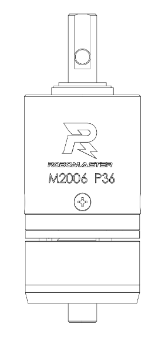
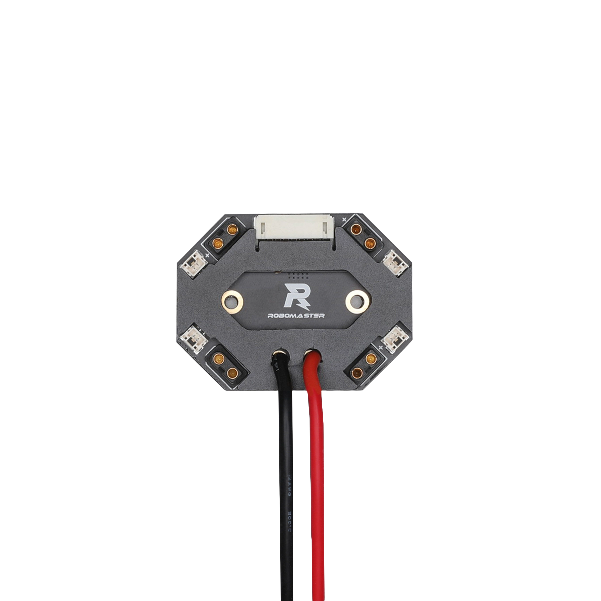

# Tutorial No. 1: Learn how to spin motors

Motors are essential to enable robot motion control. The motors we use are supplied by the company DJI which hosts the competition. There are currently four types of motors that you need to be aware of. 

GM6020: These large motors are used for turret movement. There are typically two in a single turret: one is for yaw and the other is for pitch.


M3508: These thinner motors are used for chassis movement. They control the robot’s wheels.


M2006: There is typically one of these motors located at the bottom of each feeder. It is concealed by a star-shaped-rotating part which dispenses bullets out of the feeder towards the flywheels.



Snails: These wheel-like motors are used for shooting. Their velocity sets the bullets’ speed. They’re part of the flywheel subsystem and are last to touch the bullets.


Note: *We use [yaw, pitch and roll](#yaw-pitch-and-roll) axes to portray a body’s rotation into a three-dimensional space. These terms are typically used in fields such as aircraft, watercraft and spacecraft.*


Lastly, note that we’re using a library called Taproot maintained and developed by the University of Washington’s team ARUW. This library provides a level of abstraction over electronic components. You can find the official Taproot documentation at https://aruw.gitlab.io/controls/taproot/index.html. Useful tutorials are also provided on their wiki https://gitlab.com/aruw/controls/taproot/-/wikis/home. For this training, those links will certainly come in handy.

Now let’s get practical. In this very first exercise, you’ll learn how to make motors spin.

## Part 1: Implementing the Motor Spin Command in Software

1. Checkout the branch [name] in your local repo and open the “PolySTAR-Taproot” folder in your preferred IDE.

2. Expand the PolySTAR-Taproot-project/ folder in the file explorer. You’ll notice that it contains two key folders.

The taproot folder contains the Taproot library files whereas the src folder contains our source code. You won’t ever need to make changes to the taproot folder unless you’re trying to update the library as prescribed by the Taproot maintainers.

3. Now, look up the content of the src folder. 

```
src/ 
├── algorithms/ 
├── communication/ 
├── control/ 
├── subsystems/ 
└── main.cpp
```
	

4. Go to file `PolySTAR-Taproot-project/src/subsystems/feeder/feeder_subsystem.hpp`

Inspect this file. Note that there are two overridden functions from the abstract `Subsystem` class. The `initialize` function is called once before the refresh. The `refresh` function is called periodically. Read this [wiki page](https://github.com/PolySTAR-mtl/PolySTAR-Taproot/wiki/Intro-to-CBP_Subsystems#creating-a-subsystem) for full explanation. 

In the `FeederSubsystem::initialize` method of the `.cpp`, you first need to initialize your motor. Hint: The motor object can be found in the `FeederSubsystem::initialize`. See https://aruw.gitlab.io/controls/taproot/api/classtap_1_1motor_1_1_dji_motor.html for motor documentation. 

5. Once the motors have been initialized, your code needs to specify a desired output. The method `FeederSubsystem::updateRpmPid` has been provided. RPM stands for revolutions per minute, whereas PID is an acronym for Proportional Integral Derivative. It involves mathematical equations designed to precisely approach a specific value. It is used to control motors with precision. For now, think of it as a black box. Keep in mind that it allows us to pass a set of values to the motor so it can gradually reach a specific point. 

Here is a breakdown of the `FeederSubsystem:updateRpmPid` function.

```cpp
void FeederSubsystem::updateRpmPid(modm::Pid<float>* pid, tap::motor::DjiMotor* const motor, float desiredRPM) {
    int16_t shaftRPM = motor->getShaftRPM();
    if (desiredRPM == 0) {
        motor->setDesiredOutput(0);	// sets the motor output to 0 so that it stops instantly when needed
    } else {
        pid->update(desiredRPM - shaftRPM);	// the error, which consists of subtracting the current value to the desired one, is used to update the pid controller’s value
        float pidValue = pid->getValue();
        motor->setDesiredOutput(pidValue);	// we update the desired motor output using the computed pidValue 
    }
}
```

6. For the `FeederSubsystem::updateRpmPid` method to be effective, it needs to be called. Since we want it to be called periodically, make a call to it in the `refresh` function. Hint: the parameters to pass-in are declared in the `feeder_subsystem.hpp` file.

7. Now that the FeederSubsystem is ready to be used, you need to create a command. A command is an object which represents a specific action that you want your robot to do. It can be mapped to the joystick or the switch of a remote control. In the current folder, go to the `feeder_feed_command.hpp`. Again, notice that there are four overridden functions from the abstract Command class. The initialize and the refresh functions serve essentially the same purpose for commands as they do for subsystems. The `isFinished` method is used to check if the command is done running. The end method is called once a command terminates. It is used to reset the subsystem to its initial state. In the .cpp file, add the required subsystem to your command in the constructor’s body. See https://aruw.gitlab.io/controls/taproot/api/classtap_1_1control_1_1_command.html for documentation. 

8. Next, your spinning command needs to set the feeder’s rpm. In our case, we’re trying to make the motor spin at a constant speed. You will find the `FEEDER_RPM` constant in the `feeder_constants.hpp` file. In the `FeederFeedCommand::initialize` method, set your feeder’s desired output to the `FEEDER_RPM` constant.

9. Here, we are going to make this command default so the motor should spin as soon as the system boots up. In the `FeederFeedCommand::isFinished()` method, return false. 

10. Now that our command is all set, navigate to the `PolySTAR-Taproot-project/src/control/standard` folder. The control folder contains control files available for each robot. Note that this version of the repo might not contain all robots’ files. The `standard_control.cpp` file contains all subsystems and commands that define our standard robot. That's where we determine which subsystem and commands to assign to a specific robot. For instance, if one has two different feeders, the control file will create two instances of the appropriate feeder subsystems to meet our robot’s needs. Complete TODOs in the `standard_control.cpp` file. Refer to https://github.com/PolySTAR-mtl/PolySTAR-Taproot/wiki/Code-Examples_Robot-Control for full code breakdown.


Note: drivers is a singleton that provides us with lots of useful objects without having the need to instantiate them ourselves.

## Part 2: Testing the Motor Spin Command in Hardware
Now that the programming is done, hop on the test bench and let's plug some cables. Here is a list of the required materials.

[insert big image of all required materials]

| Component | Image |
|:-------:|:-------:|
| Board A       |      |
| Center Board 2 (Board V2)       |    |
| Center Board       |  |
| Battery Rack   |    |
| Power Cables   |    |
| CAN Cables   |    |
| ST-Link   |    |
| Feeder ESC (C610)   |    |

There are 2 key types of cables: CAN and power cables. CAN cables are used to transmit data and spread commands across all subsystems. 

The board A contains an embedded processor, which serves as the processing brain of the robot. 

1. Ensure the battery rack is secured onto the battery and connect its power cable to a Center Board.
2. Now, connect a power cable from the Center Board to the Board A. Refer to the image below.


3. Connect a power cable from the Center Board to the Feeder ESC (which has to be connected to the feeder motor).
4. Connect a CAN cable from the Center Board to the Board A.

*Note: Cable management is crucial in a robot due to the numerous cables involved. Thus, poor cable management can make it difficult to locate defective cables. As a means to keep everything organized and to set some guidelines on cable management, we require that CAN and power cables coming from the same source be routed closely together and closer to the source when possible.This improves the experience when working with a robot’s circuit designed by a colleague and prevents entangled cables.*

5. Connect a CAN cable from the Board V2 to the Feeder ESC.
6. Inspect the circuit. The key to proper functioning is ensuring that power and data are distributed to all necessary subsystems and motors.
7. Now, connect your PC to board A using the ST-Link (Refer to the [programming the board A section](#how-to-program-the-robomaster-board-a)). Ensure the battery is turned off to prevent damage to your PC port.
8. In VSCode, use Ctrl+Shift+P. Select “Tasks:Run Tasks” => “Program - Release”. The Task should run in a terminal and successfully complete.
*Make sure VSCode is opened in the parent folder of `PolySTAR-Taproot-project`*
9. Disconnect the ST-Link from your PC.
10. Double-press the round button on the battery, holding the button down on the second press to turn the battery on. Use the switch to power the circuit. Here’s a tip: Pressing the button once will display the remaining power of the battery.
11. The motor may not spin if its ID is not correctly set. Each motor in a robot has a unique identifier ranging from 1 to 8. You can find the feeder motor ID value in the feeder_subsystem.hpp file. To set the ID on the motor, you can see the [Feeder ESC documentation](https://drive.google.com/file/d/1pCrj0jPPjUYpcDPXx7F_7sFX1r0z-Dlv/view?usp=sharing) at page 12 (Set key operation)  
12. The motor should start spinning. Excellent! Next, let’s map this command to the remote control. Start by turning the battery off. 
13. To use the remote, we must ensure that the `FeederFeedCommand` stops the motor when the command terminates. In the `FeederFeedCommand::end` method of the `FeederFeedCommand.cpp` file, set the motor’s output to 0 RPM to stop it from spinning.
14. Since the command is now mapped and not default, remove the return statement in the `FeederFeedCommand::isFinished()`.
15. In the `StandardControl.cpp` file, remove the `FeederFeedCommand` from the `setDefaultStandardCommands` function.
16. Scroll up and define a `HoldCommandMapping` for the `FeederFeedCommand`. Map this command to the right switch so that the command is activated when the switch is in the 'up' position.
17. Add the command mapping to the `registerStandardIoMappings` function. Reload the code on the Board A and power up the system (refer to steps 7-10). 
18. Connect the remote control receiver to the Board A. Ensure the brown connector is linked to the “ground”. Refer to the image bellow


19. Turn on the remote control and set the right switch to the 'up' position. The motor should now spin. Congratulations! Now, you can officially control motors!

## Yaw, Pitch and Roll


As depicted in the picture, these rotation axes resemble the x, y and z axes that make up a three-dimensional plane except they’re not fixed; instead, they are relative to the body. Here are some easy tips to remember, use hand gestures to assimilate:

Yaw: Think of a silent handclap. 
Roll: Easy. Imagine a dog rolling on its side or a door handle twisting.
Pitch: Baseball: throw a ball.

## How to program the Robomaster Board A
You'll need a Robomaster Board A and an ST-Link (with cable)

### Connect the ST-Link to the Board A like this:


 Make sure the pins are correctly connected in the ST-Link

| Board A | ST-Link |
|:-------:|:-------:|
| +       | 3.3V    |
| G       | GND     |
| SWCLK   | SWCLK   |
| SIDIO   | SWDIO   |

You can now program the Board A ヾ(≧▽≦*)o

### Programming Board A
If you're using vs code, make sure you're in the folder parent to `PolySTAR-Taproot-project`.
Then open the Command Palette (Ctrl + Shift + P) and select "Tasks: Run Task".
Select the right task depending on what robot you want to program.
*Note: Program - Release and .Program Standard are the same*

That's it! You have programmed the Board A! ᕦ(ò_óˇ)ᕤ